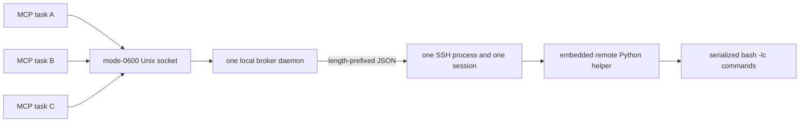

# Persistent O2 command broker MVP

## Problem

OpenSSH multiplexing reuses a TCP connection and authentication context, but a
subsequent `ssh host command` still opens a new SSH session channel. Observed O2
behavior in August 2026 showed a Duo call during that operation even though the
child process opened only the expected local mux socket and no new TCP socket.
ControlMaster socket pinning remains necessary to prevent authentication
fallback, but it is not sufficient to suppress per-session challenges.

## Authentication and command boundaries



Starting the broker is the authentication boundary. It consumes the existing
login-scoped one-shot grant, including the off-VPN scope, and launches exactly
one direct SSH transport. It deliberately sets `-S none`, `ControlMaster=no`,
and `ControlPath=none`: binding the broker lifetime to an older mux master would
reintroduce the disappearance and channel-lifetime problem the broker is meant
to solve.

The grant-consuming parent holds the global policy mutex until the detached
daemon acknowledges that it has spawned SSH. A policy disable therefore either
precedes grant consumption and prevents launch, or follows an already-started
operation. The daemon records the login attempt as successful only after the
remote helper sends the expected protocol hello.

There is no automatic retry or reconnect. A startup timeout leaves one attempt
receipt for inspection. A later task must not infer that it may start another
channel from the absence of a ready socket.

## Protocol

Every frame is:

```text
4-byte ASCII magic: O2B1
4-byte unsigned big-endian payload length
UTF-8 JSON object of exactly that length
```

The daemon may scan through at most 64 KiB of unframed output before the first
remote hello, accommodating a login-shell banner. Every later frame is strict.

The remote helper first emits:

```json
{"type":"hello","protocol":1}
```

A logical command request contains a random request id, command, timeout, and
optional stdin text. The helper executes `/bin/bash -lc <command>`, captures both
output streams, and returns the same id, return code, duration, timeout flag,
and truncation flags. Commands are serialized so responses cannot be reordered.

The frame limit is 16 MiB. Stdout and stderr are each truncated at 1 MiB before
encoding. A remote timeout returns code 124 and the helper remains available for
the next frame.

## Local authority and failure behavior

- `~/.agent_locks/o2-broker` defaults to a physical owner-only mode-0700
  directory. `O2_BROKER_DIR` may override it only with an absolute path.
- `command.sock`, state, launch, config snapshot, lock, and log are owner-only.
  Symlinked or permissive authority files fail closed.
- One lifetime `flock` prevents two daemons from owning the endpoint.
- Both `O2Connection.run` and the daemon re-read `O2_POLICY.json` before a
  command. A global disable cannot be bypassed with a direct socket client.
- Disabling policy does not kill an already-running command or broker. It blocks
  the next frame. `o2_stop_broker` is an explicit local process-control action.
- If SSH exits or framing fails, the daemon removes its socket, writes a failed
  receipt, terminates the child if necessary, and exits. It never reconnects.
- `o2_local_status` may read the receipt and ping the Unix socket, but it never
  sends a frame to O2.

## MVP boundaries

This first broker is login-host command transport only. `o2_exec`, Slurm tools,
workspace tools, keepalive, and run-organization commands all reach it through
`O2Connection.run`. Login-node raw SSH is rejected.

Existing detached rsync transfers are not terminated or migrated. Transfer
commands still use the separately governed compatibility path and should not be
described as Duo-free: a future transfer broker or non-SSH transfer mechanism is
needed to eliminate that distinct session boundary.

## Offline validation

`tests/unit/test_broker.py` runs the exact embedded remote helper as a local
Python child. It proves that multiple clients and dynamically different commands
share one process, command stdin and multiline output survive framing, timeouts
do not reconnect, policy disable blocks forwarding, an absent broker stays
local-only, and the detached launcher consumes one grant then reuses one daemon.
No test in this PR contacts O2 or starts SSH.
