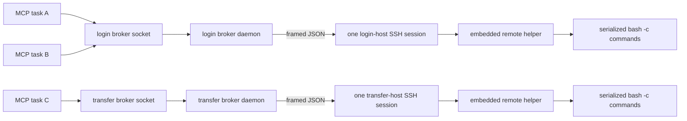

# Persistent O2 command broker MVP

## Problem

OpenSSH multiplexing reuses a TCP connection and authentication context, but a
subsequent `ssh host command` still opens a new SSH session channel. Observed O2
behavior in August 2026 showed a Duo call during that operation even though the
child process opened only the expected local mux socket and no new TCP socket.
ControlMaster socket pinning remains necessary to prevent authentication
fallback, but it is not sufficient to suppress per-session challenges.

## Authentication and command boundaries



Starting either role-specific broker is an authentication boundary. It consumes
the matching login- or transfer-scoped one-shot grant, including the off-VPN
scope, and launches exactly one direct SSH transport. It deliberately sets
`-S none`, `ControlMaster=no`, and `ControlPath=none`: binding broker lifetime to
an older mux master would reintroduce the disappearance and channel-lifetime
problem the broker is meant to solve.

The grant-consuming parent holds the global policy mutex while it starts only
the local detached daemon, then releases it so the daemon can perform its own
authorization gate. Immediately around SSH creation, the daemon reacquires the
mutex and verifies that the grant id, role, originating client, and parent PID
still match the active consumed attempt. A policy disable therefore either wins
the handoff and prevents SSH or follows an already-started operation. Launch
data is sent only through a bounded anonymous pipe inherited by that child; no
same-UID-replaceable path or durable recipe exists. The daemon records the login
attempt as successful only after the remote helper sends the expected protocol
hello.

There is no automatic retry or reconnect. The remote protocol hello has the same
finite startup deadline as the launcher, so a silent child cannot retain the
lifetime lock indefinitely. A startup timeout leaves one attempt receipt for
inspection. A later task must not infer that it may start another channel from
the absence of a ready socket.

## Protocol

Every frame is:

```text
4-byte ASCII magic: O2B1
4-byte unsigned big-endian payload length
UTF-8 JSON object of exactly that length
```

The daemon may scan through at most 64 KiB of unframed output before the first
remote hello, accommodating a login-shell banner. Every later frame is strict.

The remote helper first emits:

```json
{"type":"hello","protocol":2}
```

A logical command request contains protocol version 2, a random request id,
command, timeout, and optional stdin text. Explicit versioning prevents either
side of an in-place client/daemon upgrade from misinterpreting acknowledgement
semantics and executing an apparently failed request. The helper executes
`/bin/bash --noprofile --norc -c <command>` in the environment inherited from
the one SSH session, so per-command login profiles cannot add banners or consume
timeouts. It concurrently drains both output streams while retaining bounded
prefixes, and returns the same id, return code, duration, timeout flag, and
truncation flags. Commands are serialized within each broker so responses cannot
be reordered.

The frame limit is 16 MiB. Stdout and stderr retain at most 1 MiB each; later
bytes are drained and discarded rather than accumulated in memory. A remote
timeout returns code 124 and the helper remains available for the next frame.

The local client first waits for a `dispatched` acknowledgement, which the daemon
writes only when the request reaches the serialized execution boundary and the
policy still permits it. Queue delay does not consume the command's remote
timeout. A caller that disconnects before acknowledgement is cancelled locally;
if the result stream is lost after acknowledgement, the MCP reports
`broker_outcome_unknown` with `retry_safe=false` instead of inviting an unsafe
automatic retry.

## Local authority and failure behavior

- `~/.agent_locks/o2-broker` and
  `~/.agent_locks/o2-transfer-broker` default to distinct physical owner-only
  mode-0700 directories. `O2_BROKER_DIR` and `O2_TRANSFER_BROKER_DIR` may
  override them only with distinct absolute paths.
- `command.sock`, state, config snapshot, lock, and log are owner-only.
  Symlinked or permissive authority files fail closed. Authentication-capable
  launch data never enters the filesystem; it is consumed once from a bounded
  inherited descriptor before any SSH spawn.
- A client connects only when a physical mode-0600 state receipt positively
  reports `ready` under the exact protocol version; missing, malformed, or
  stale-version receipts are not treated as compatible defaults.
- Command reuse also requires both the SSH alias and its expanded
  `HostName`/`User`/`Port` identity to match that role's current inspected
  configuration. A local stop remains available after a destination or protocol
  change so the stale daemon can be retired safely without sending a remote
  command.
- One lifetime `flock` per role prevents two daemons from owning an endpoint.
- Both `O2Connection.run` and the daemon re-read `O2_POLICY.json` before a
  command. A global disable cannot be bypassed with a direct socket client.
- Disabling policy does not kill an already-running command or broker. It blocks
  the next frame. `o2_stop_broker` is an explicit local process-control action.
- If SSH exits or framing fails, the daemon removes its socket, writes a failed
  receipt, terminates the child if necessary, and exits. It never reconnects.
- The first local frame has an absolute five-second deadline, so a same-user
  process cannot wedge the serialized broker by sending an incomplete or
  byte-trickled request. Local response writes are bounded by the same deadline.
- `o2_local_status` may read the receipt and ping the Unix socket, but it never
  sends a frame to O2.

## MVP boundaries

`o2_exec`, Slurm tools, workspace tools, and keepalive reach the login broker
through `O2Connection.run`. Run-organization reads normally use that broker;
promotion and archive launches that must run on the transfer host use its
separate persistent broker. Raw SSH commands are rejected for both roles.

Existing detached rsync transfers are not terminated or migrated. Transfer
data still uses the separately governed ControlMaster compatibility path and
should not be described as Duo-free. The transfer command broker eliminates raw
SSH only for commands; replacing rsync's distinct session boundary remains
future work. New rsync operations default to the dedicated transfer alias because
that role retains an explicit grant-gated master startup. Login-alias rsync can
reuse a legacy master but cannot create one through either the MCP wrapper or
the public connection API. `o2_stop_master` and
`O2Connection.stop_master()` close the supported transfer master locally through
its exact socket.

## Offline validation

`tests/unit/test_broker.py` runs the exact embedded remote helper as a local
Python child. It proves that multiple clients and dynamically different commands
share one process, command stdin and multiline output survive framing, noisy
output stays bounded, queue time is separated from command time, an abandoned
queued request is not dispatched, protocol-hello timeout releases the lock,
policy disable blocks forwarding, and detached role-specific launchers consume
one matching grant then reuse one daemon. Run-organization tests prove transfer
commands select the transfer broker. No test in this PR contacts O2 or starts
SSH.
