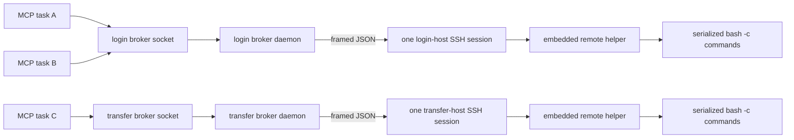

# Persistent O2 command broker MVP

## Problem

OpenSSH multiplexing reuses a TCP connection and authentication context, but a
subsequent `ssh host command` still opens a new SSH session channel. Observed O2
behavior in August 2026 showed a Duo call during that operation even though the
child process opened only the expected local mux socket and no new TCP socket.
ControlMaster socket pinning remains necessary to prevent authentication
fallback, but it is not sufficient to suppress per-session challenges.

## Authentication and command boundaries



Starting either role-specific broker is an authentication boundary. It consumes
the matching login- or transfer-scoped one-shot grant, including the off-VPN
scope, and launches exactly one direct SSH transport. It deliberately sets
`-S none`, `ControlMaster=no`, and `ControlPath=none`: binding broker lifetime to
an older mux master would reintroduce the disappearance and channel-lifetime
problem the broker is meant to solve.

The grant-consuming parent holds the global policy mutex while it starts only
the local detached daemon, then releases it so the daemon can perform its own
authorization gate. Immediately around SSH creation, the daemon reacquires the
mutex and verifies that the grant id, role, originating client, and parent PID
still match the active consumed attempt. A policy disable therefore either wins
the handoff and prevents SSH or follows an already-started operation. Launch
data is sent only through a bounded anonymous pipe inherited by that child; no
same-UID-replaceable path or durable recipe exists. The daemon records the login
attempt as successful only after the remote helper sends the expected protocol
hello and the owner-only local socket plus trusted ready receipt are published.

There is no automatic retry or reconnect. The remote protocol hello has the same
finite startup deadline as the launcher, so a silent child cannot retain the
lifetime lock indefinitely. A startup timeout leaves one attempt receipt for
inspection. A later task must not infer that it may start another channel from
the absence of a ready socket.

## Protocol

Every frame is:

```text
4-byte ASCII magic: O2B1
4-byte unsigned big-endian payload length
UTF-8 JSON object of exactly that length
```

Logical command text is capped at 64 KiB because it becomes a remote
`bash -c` argument; this keeps a valid frame below the host's `execve` argument
limit. Larger scripts must be transferred as files and invoked with a short
command. Process-spawn failures return an ordinary command result and do not
terminate the persistent helper. The client validates the complete JSON-escaped
request before connecting, and stdin is capped at 1 MiB, so expansion cannot
fail after dispatch and bulk payloads remain on the transfer path.

The daemon may scan through at most 64 KiB of unframed output before the first
remote hello, accommodating a login-shell banner. Every later frame is strict.

The remote helper first emits:

```json
{"type":"hello","protocol":2}
```

A logical command request contains protocol version 2, a random request id,
command, timeout, and optional stdin text. A JSON `null` timeout preserves the
public API's explicit no-deadline behavior; finite deadlines must be positive
and no longer than seven days so local socket timeouts stay platform-safe.
Explicit versioning prevents either side of an in-place client/daemon upgrade
from misinterpreting acknowledgement semantics and executing an apparently
failed request. The helper executes
`/bin/bash --noprofile --norc -c <command>` in the environment inherited from
the one SSH session, so per-command login profiles cannot add banners or consume
timeouts. It concurrently drains both output streams while retaining bounded
prefixes, and returns the same id, return code, duration, timeout flag, and
truncation flags. Commands are serialized within each broker so responses cannot
be reordered.

The frame limit is 16 MiB. Stdout and stderr retain at most 1 MiB each; later
bytes are drained and discarded rather than accumulated in memory. A remote
timeout returns code 124 and the helper remains available for the next frame.
For finite commands, the daemon separately bounds its result-frame wait with an
inactivity timeout and a frame-size-scaled absolute budget. Slow response
progress refreshes the inactivity deadline; if SSH remains alive but the helper
stops responding, the daemon terminates and unpublishes the sole transport. The
dispatched outcome remains unknown and is never retried automatically.

The local client first waits for a `dispatched` acknowledgement, which the daemon
writes only when the request reaches the serialized execution boundary and the
policy still permits it. Queue delay does not consume the command's remote
timeout. A caller that disconnects before acknowledgement is cancelled locally;
if the result stream is lost after acknowledgement, the MCP reports
`broker_outcome_unknown` with `retry_safe=false` instead of inviting an unsafe
automatic retry.

## Local authority and failure behavior

- `~/.agent_locks/o2-broker` and
  `~/.agent_locks/o2-transfer-broker` default to distinct physical owner-only
  mode-0700 directories. `O2_BROKER_DIR` and `O2_TRANSFER_BROKER_DIR` may
  override them only with distinct absolute filesystem authorities; paths are
  canonicalized and existing identities compared so `..` or symlinked
  ancestors cannot make both roles share one socket/lock directory.
- `command.sock`, state, lock, and log are owner-only.
  Symlinked or permissive authority files fail closed. Authentication-capable
  launch data never enters the filesystem; it is consumed once from a bounded
  inherited descriptor before any SSH spawn. The inspected `ssh -G` expansion
  is sealed directly into that launch argv, while SSH reads `-F /dev/null`, so
  there is no replaceable config pathname between authorization and spawn.
- A client connects only when a physical mode-0600 state receipt positively
  reports `ready` under the exact protocol version; missing, malformed, or
  stale-version receipts are not treated as compatible defaults.
- Command reuse also requires both the SSH alias and its expanded
  `HostName`/`User`/`Port` identity to match that role's current inspected
  configuration. A local stop remains available after a destination or protocol
  change so the stale daemon can be retired safely without sending a remote
  command.
- One lifetime `flock` per role prevents two daemons from owning an endpoint.
- Both `O2Connection.run` and the daemon re-read `O2_POLICY.json` before a
  command. A global disable cannot be bypassed with a direct socket client.
- The remote frame write has a five-second inactivity deadline plus a
  frame-size-scaled total deadline while the policy mutex is held. Continued
  progress is allowed at slow-link rates; a stalled SSH stdin terminates that
  broken transport and releases global policy authority instead of blocking
  incident disable.
- Disabling policy does not kill an already-running command or broker. It blocks
  the next frame. `o2_stop_broker` is an explicit local process-control action.
- If SSH exits or framing fails, the daemon removes its socket, writes a failed
  receipt, terminates the child if necessary, and exits. It never reconnects.
- The first local frame has an absolute five-second deadline, so a same-user
  process cannot wedge the serialized broker by sending an incomplete or
  byte-trickled request. Local response writes are bounded by the same deadline.
- `o2_local_status` may read the receipt and ping the Unix socket, but it never
  sends a frame to O2.

### Bounding one caller's cost

- A single `o2_exec` may request at most 300 seconds. That number is both how
  long one command can block every other caller on the shared channel and the
  watchdog budget before a silent transport is torn down. Work needing longer
  belongs in a submitted job polled from the caller, which releases the channel
  between checks.
- The wait for a dispatch acknowledgement is bounded too, scaled to the caller's
  own deadline (`max(60s, timeout_seconds)`, or 300s when no deadline was
  given). That budget starts at the connection, not after it: the daemon accepts
  nothing while serving a command, so callers fill the listen backlog and
  eventually `connect` itself blocks. A short ceiling there would report a
  healthy but saturated broker as *absent*, which is the one diagnosis that
  points a caller at starting another one. A receipt that fails validation still
  raises before any connection, so a genuinely missing broker keeps its own
  error. Without this bound a starved caller simply never returns, which is
  indistinguishable from a hang; `o2_exec` reports it as `broker_busy` and the
  message names the command occupying the channel from the in-flight receipt.
- A budget expiry is **not** proof the request was never dispatched. The daemon
  writes the acknowledgement and forwards the command as one step, so a budget
  expiring in that instant leaves a command running and a caller that never read
  the acknowledgement. `O2BrokerBusyError` therefore subclasses
  `O2BrokerCommandOutcomeUnknownError` and reports `retry_safe: false`, so a
  mutating command cannot be duplicated by a caller trusting an optimistic
  classification. The receipt settles the one direction it can: when the request
  recorded in flight is the caller's own, the command is known to be running and
  the error says so outright.
- Abandoning the socket is also how the daemon learns to cancel a queued
  request. It checks for a disconnected caller before forwarding, so a timed-out
  request is dropped rather than run unobserved.

### Stopping a broker that cannot answer

- `o2_stop_broker` asks over the socket. That retires an idle broker cleanly and
  **cannot** retire a busy one: the request queues behind the command holding the
  channel, and the daemon cancels a queued stop whose caller has already timed
  out. The failure now names the occupying command and points at `force`.
- `force: true` signals the daemon instead. `SIGTERM` is handled and sets the
  same graceful stop flag, so the transport closes, the socket is removed and the
  lock is released through the ordinary exit path. It is still graceful: the
  accept loop observes the flag only after the in-flight command ends, so a busy
  daemon exits *later*, and the result distinguishes `exited: true` from a stop
  merely requested. Abandoning a running command outright remains a manual
  `kill -9`, which leaves an orphaned receipt that `busy` correctly ignores.
- `force` is opt-in rather than an automatic fallback because it acts on a pid
  read from a receipt rather than through the socket's own authority. It refuses
  unless a daemon holds the lifetime lock *and* the pid exists and is owned by
  this user; a stale receipt is never signalled.

### Bounding one caller's cost, part two

- The 300s cap on `o2_exec` guards one input model. `BrokerClient.execute`
  enforces a 3600s ceiling for **every** caller, including in-process ones, so a
  library caller cannot reinstate a multi-hour hold. The protocol itself still
  permits seven days; nothing should want it.
- An explicit `timeout=None` remains supported and unbounded by design. It is
  not a wedge risk: a dead helper, a dead SSH process, and a black-holed network
  all close the transport's stdout, so the daemon's read ends in every failure
  mode. The only unbounded case is a command that genuinely never finishes,
  which is what the caller asked for.

### Command observability

The daemon serializes local clients over one channel, so it cannot answer a
ping while a command is running. Any command slower than the ping deadline
therefore makes a healthy broker report `responsive: false`, which on its own
is indistinguishable from a daemon that has stopped serving. The receipt
carries the missing half of that picture:

- `in_flight` names the command currently holding the channel (`request_id`,
  bounded command fingerprint, requested `timeout_seconds`, `dispatched_at`)
  and is `null` whenever the channel is idle. It is written before the daemon
  waits for a result and is retained by the terminal receipt, so a daemon that
  dies mid-command still records what it was running.
- `last_command` records the completed command plus `duration_seconds` — the
  broker-observed channel occupancy, which is what starves other callers —
  alongside the helper's own `remote_duration_seconds`, `returncode`,
  `timed_out`, and truncation flags. Remote-reported numbers are filtered to
  finite, plausibly sized values before they reach a file later readers must
  still parse.
- `local_status` consults that record only when the ping went unanswered, and
  then reports `busy` and `busy_for_seconds` so the caller learns which command
  is responsible instead of only that no answer arrived. A successful pong
  reports `busy: false` regardless of the record: a serialized daemon can only
  answer between commands, so a pong is positive proof that nothing occupies
  the channel, and it retires an `in_flight` entry that a suppressed
  best-effort write would otherwise leave standing. A terminal receipt keeps
  its `in_flight` record for forensics but is never reported as busy.
- `duration_seconds` is measured with `time.monotonic()`, like every other
  deadline in the daemon, so an NTP or manual wall-clock step during a long
  command cannot inflate the metric or collapse it to zero. The epoch
  timestamps beside it are for operator reading, not arithmetic.
- The in-flight receipt is published after the remote frame write, so another
  process reads `busy: false` for that write's duration. Publishing earlier
  would place an unbounded fsync inside the policy mutex, whose hold time is
  deliberately bounded so an incident disable stays responsive. The window is
  bounded by the write deadline, a write that fails inside it is still named by
  the terminal receipt, and occupancy already covers it because timing starts at
  the acknowledgement.
- `busy` also requires that a daemon still holds the lifetime lock. A daemon
  killed before its terminal write -- SIGKILL, a crash, a reboot -- leaves a
  `ready` receipt naming a command nothing will retire, and without that check
  it would report busy forever. `busy_for_seconds` is derived from a persisted
  monotonic reading rather than the epoch, which is sound precisely because a
  held lock implies a live daemon and therefore the same boot. That reading
  names its clock explicitly (`CLOCK_MONOTONIC`) instead of relying on
  `time.monotonic()`, whose reference point is implementation-defined: on macOS
  it maps to `mach_absolute_time()`, which excludes time the host spent asleep
  and so differs from `CLOCK_MONOTONIC` on the same machine by however long it
  has slept. Publishing one and subtracting the other would be silently wrong
  by that amount. Where the named clock is unavailable the field is omitted
  rather than guessed.
- The record is best effort, not a ledger. Consecutive suppressed writes can
  leave it naming an earlier command than the one actually running; it is a
  diagnostic aid, and the pong remains the authority on whether the channel is
  free.
- Busy is not un-ready. `status` stays `ready` while a command runs, because a
  busy broker is still a reusable broker: later clients queue behind the
  in-flight command rather than being refused for lacking a ready receipt.
- The command fingerprint is a SHA-256 digest, a UTF-8 byte length, and a
  preview bounded to the first 200 characters. The full command is deliberately
  not copied into the receipt, so a repeat offender stays identifiable without
  retaining arguments that may embed sensitive paths.
- The dispatch-time receipt write is best effort. It is diagnostic, so a
  transient failure must not abort a command the channel is ready to run.

## MVP boundaries

`o2_exec`, Slurm tools, workspace tools, and keepalive reach the login broker
through `O2Connection.run`. Run-organization reads normally use that broker;
promotion and archive launches that must run on the transfer host use its
separate persistent broker. Raw SSH commands are rejected for both roles.

Existing detached rsync transfers are not terminated or migrated. Transfer
data still uses the separately governed ControlMaster compatibility path and
should not be described as Duo-free. The transfer command broker eliminates raw
SSH only for commands; replacing rsync's distinct session boundary remains
future work. New rsync operations default to the dedicated transfer alias because
that role retains an explicit grant-gated master startup. Login-alias rsync can
reuse a legacy master but cannot create one through either the MCP wrapper or
the public connection API. `o2_stop_master` and
`O2Connection.stop_master()` close either the supported transfer master or a
pre-upgrade login master locally through its exact socket with authentication
disabled. This shutdown compatibility does not restore login-master startup.

## Offline validation

`tests/unit/test_broker.py` runs the exact embedded remote helper as a local
Python child. It proves that multiple clients and dynamically different commands
share one process, command stdin and multiline output survive framing, noisy
output stays bounded, queue time is separated from command time, an abandoned
queued request is not dispatched, protocol-hello timeout releases the lock,
policy disable blocks forwarding, and detached role-specific launchers consume
one matching grant then reuse one daemon. Run-organization tests prove transfer
commands select the transfer broker. No test in this PR contacts O2 or starts
SSH.
